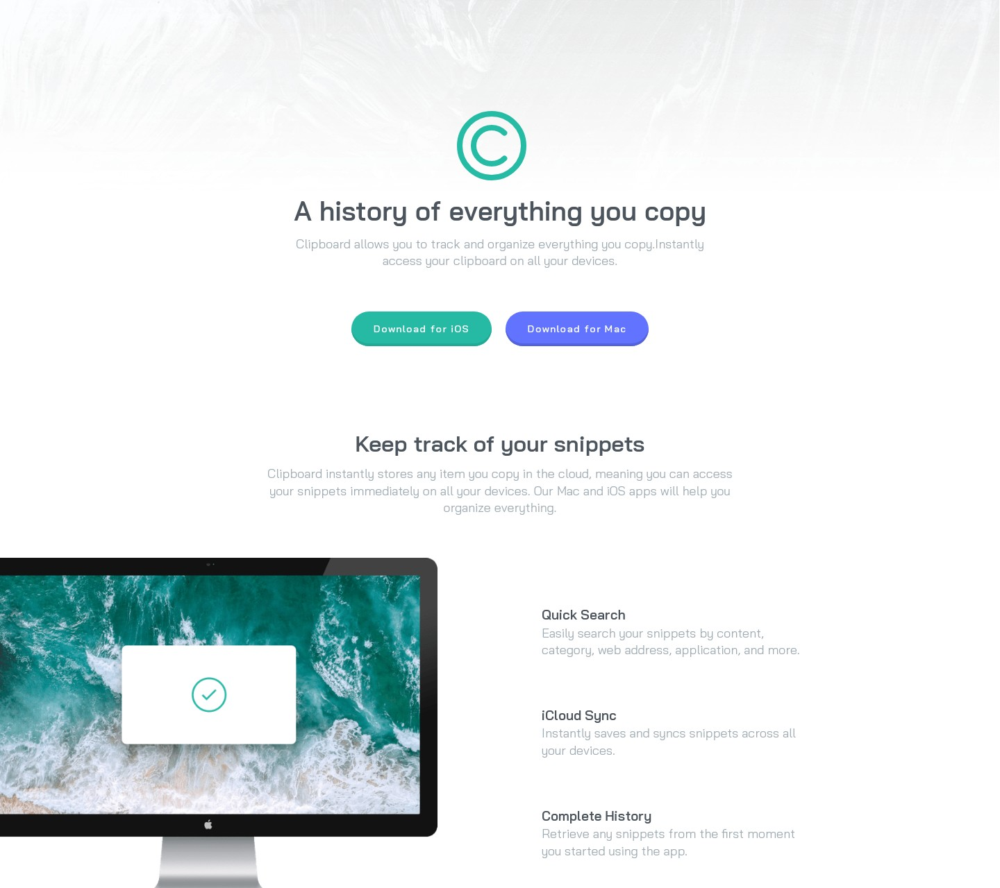
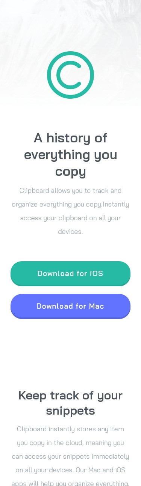

# Frontend Mentor - Clipboard landing page solution

Hello 👋

This is a solution to the [Clipboard landing page challenge on Frontend Mentor](https://www.frontendmentor.io/challenges/clipboard-landing-page-5cc9bccd6c4c91111378ecb9). Frontend Mentor challenges help you improve your coding skills by building realistic projects.

## Table of contents

- [Overview](#overview)
- [Screenshot](#screenshot)
- [Links](#links)
- [Built with](#built-with)
- [Author](#author)

### Screenshot

### Links

[live Site - Clipboard landing page solution](https://mateus-lr.github.io/Clipboard-landing-page-master/)

### Built with

- Semantic HTML5 markup
- CSS custom properties
- Flexbox
- CSS Grid

## Author

- Website - [Mateus Rocha](https://github.com/mateus-lr)
- Frontend Mentor - [@mateus-lr](https://www.frontendmentor.io/profile/mateus-lr)
- Twitter - [@maatscript](https://www.twitter.com/maatscript)
